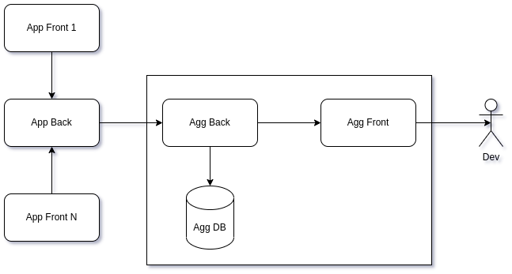

# Logs monitoring PWA

This is logs aggregator for '[@flancer32/dup-proto](https://github.com/flancer32/dup-proto)' project. It is rather a
_Proof of Concept_ than a real, full-featured application but this service helps me in `dup-proto` development. All
fronts of `dup-proto` project can send own logs to project's back then `dup-proto` back sends own logs and fronts' logs
to this aggregator.

## Overview



Logs monitoring PWA consists of 3 parts:

* `Agg Back`: `nodejs` app, collects logs entries from logs producer(s), temporary saves logs in `Agg DB`, transmits
  logs to `Agg Front` (or fronts) in real time.
* `Agg DB`: RDB (MySQL/PostgreSQL/SQLite), stores the latest logs (the last 100 entries or today's logs).
* `Agg Front`: PWA in browser, filters and displays received logs to developers.

This is screenshot of `Agg Front`:


It's a list of log entries with one filter (by `dup-prot` front UUID, I need one only filter now).

## Log entry structure

Logs aggregator awaits for entries with following structure (JSON types):

* `data` (datetime): UTC time for logged event.
* `level` (integer number): some logging level, any integer number.
* `message` (string): log message itself, `text` type for PostgreSQL DB.
* `source` (string): log source (file name or class name), `varchar(255)` type for PostgreSQL DB.
* `meta` (object): any related metadata, `jsonb` type for PostgreSQL DB.

Aggregator collects log entries and saves its to internal DB (PostgreSQL, MySQL, SQLite) for very short time (minutes or
hours). `Agg Front` app loads the last 20 entries from backend on startup.

The first 4 attributes are common. Almost all loggers use `date`, `message`, `level` and `source` in logging. The last
attribute `meta` is an object. Structure of this object depends on project needs where logger is used. Aggregator knows
nothing about this structure, it just stores log entry in DB for a short time.

This is valid JSON for incoming logs that aggregator can process:

```json
{
  "date": "2022-03-16T14:47:29.788Z",
  "level": 0,
  "message": "Event #463d8b4e-8c61-4f40-b6dd-c5590cbc33a9 (Fl32_Dup_Shared_Event_Front_Msg_Read) is published to back and removed from front queue.",
  "meta": {"frontUuid": "bf47e3f1-2829-43ca-82bd-82a819311065", "backUuid": "7792fea5-612e-4f20-9ed3-830a46162b54"},
  "source": "TeqFw_Web_Front_App_Connect_Event_Direct_Portal"
}
```

## Log details

Metadata is displayed in details as "key:value" pairs:


## Filters

Developer can filter log entries in `Agg Front` using metadata. I use one only filter now - by `front UUID` (this is a
front of `dup-proto` app).


## Resume

This logs monitoring service is just a tool that helps me in development of web apps. In case of someone wants to try
similar logs monitoring for developers in own projects, please contact me:

* **email**: alex@flancer32.com
* **skype**: alex.gusev.work
* **telegram**: @wiredgeese

It is free for none-commercial projects.
